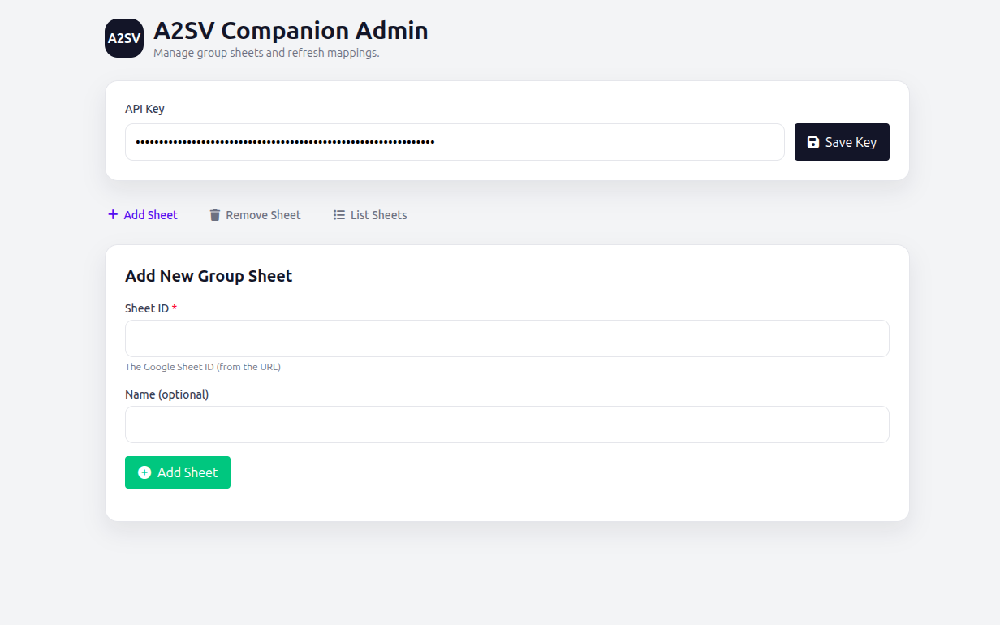

# A2SV Companion Backend

Backend service for syncing submissions from the A2SV Companion extension to GitHub and Google Sheets.

## Admin UI Screenshot

## Admin Manual (Quick)
1. Open /admin and enter your ADMIN_API_KEY.
2. Add a group sheet by ID (from the Google Sheets URL).
3. Use “Refresh Mapping Now” to pull questions from the sheet headers.
4. Use “List Sheets” to confirm tracked sheets.
5. Remove a sheet when it’s no longer needed.

## Notes
- Admin API key is required for all admin actions.
- Mapping reads headers from rows 1–5 and scans columns from H onward.